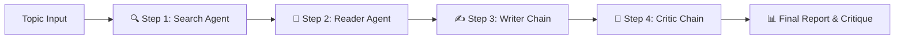

# 🔎 Multi-Agent Research System

[](https://www.python.org/)
[](https://www.langchain.com/)
[](https://streamlit.io/)
[](https://ai.google.dev/)
[](https://tavily.com/)

An autonomous, multi-agent AI research pipeline that discovers, scrapes, synthesizes, and critically evaluates deep research on any topic. Built with **LangChain**, **Google Gemini**, **Tavily AI**, **BeautifulSoup**, and **Streamlit**.

---

## 🚀 How It Works



1. **🔍 Step 1: Search Agent**
   - Uses **Tavily AI** to execute live web searches.
   - Extracts relevant URLs, titles, and snippets.
2. **📖 Step 2: Reader Agent**
   - Selects the most authoritative source URL.
   - Scrapes and parses high-density text content using **BeautifulSoup**.
3. **✍️ Step 3: Writer Chain**
   - Synthesizes raw search results and scraped webpage content.
   - Structures a comprehensive report with Introduction, Key Findings, and References.
4. **🧐 Step 4: Critic Chain**
   - Rigorously evaluates the generated report for accuracy, clarity, and depth.
   - Outputs a score (X/10), strengths, areas for improvement, and a final verdict.

---

## 📂 Project Structure

```text
├── app.py              # Streamlit Web UI application
├── pipeline.py         # End-to-end multi-agent orchestration pipeline
├── agent.py            # Agent definitions, prompts, and LCEL chains
├── tools.py            # Custom tools (Tavily search & BeautifulSoup scraper)
├── requirements.txt    # Project dependencies
├── .env.example        # Template for environment variables
└── README.md           # Documentation
```

---

## 🛠️ Getting Started

### 1. Prerequisites
- Python 3.10+
- A free [Google AI Studio API Key](https://aistudio.google.com/app/apikey)
- A free [Tavily Search API Key](https://tavily.com/)

### 2. Clone the Repository
```bash
git clone https://github.com/<YOUR_USERNAME>/<YOUR_REPO_NAME>.git
cd <YOUR_REPO_NAME>
```

### 3. Create a Virtual Environment & Install Dependencies
```bash
python -m venv venv

# Windows
venv\Scripts\activate

# macOS / Linux
source venv/bin/activate

pip install -r requirements.txt
```

### 4. Configure Environment Variables
Create a `.env` file in the root directory:
```env
TAVILY_API=your_tavily_api_key_here
GEMINI_API=your_gemini_api_key_here
GOOGLE_API_KEY=your_gemini_api_key_here
GEMINI_MODEL=gemini-3.1-flash-lite
```

---

## 💻 Running the Application

### Option A: Interactive Web UI (Streamlit)
```bash
streamlit run app.py
```
Open [http://localhost:8501](http://localhost:8501) in your browser.

### Option B: Command Line Pipeline
```bash
python pipeline.py
```
Enter your topic when prompted in the terminal.

---

## 🌐 Deploying to Streamlit Community Cloud

1. Push your repository to **GitHub**.
2. Visit [share.streamlit.io](https://43uflwzwnam7x8qv2zpvru.streamlit.app/) and click **New App**.
3. Select your repository, set branch to `main`, and main file path to `app.py`.
4. Open **Advanced settings... &rarr; Secrets** and paste:
   ```toml
   TAVILY_API = "your_tavily_api_key"
   GEMINI_API = "your_gemini_api_key"
   GOOGLE_API_KEY = "your_gemini_api_key"
   GEMINI_MODEL = "gemini-3.1-flash-lite"
   ```
5. Click **Deploy**! 🚀

---

## ⚙️ Configuration Reference

| Environment Variable | Description | Default |
|---|---|---|
| `GEMINI_API` | Google Gemini API Key | Required |
| `TAVILY_API` | Tavily Web Search API Key | Required |
| `GEMINI_MODEL` | Gemini LLM Model Identifier | `gemini-3.1-flash-lite` |

-----